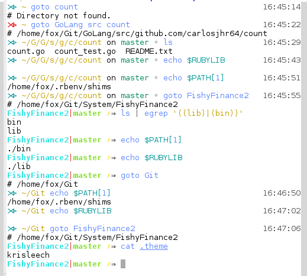

#### goto
> A plugin for [Oh My Fish][omf-link].

[](/LICENSE)
[](http://fishshell.com)
[](https://www.github.com/oh-my-fish/oh-my-fish)

<br/>

## Install

If registered, one should be able to run the following:

```fish
$ omf install goto
```

Otherwise, cloning this git to ~/.config/omf/pkg/goto should work.

## Usage

```fish
⋊> ~ goto <basename> [<basename>...]
```

In a nutshell, it just runs the following command:

```fish
⋊> ~ cd (find ~/ -maxdepth 3 -type d -name "$argv[1]")
```

But wait, there's more!  After it changes directory,
if it finds a ./bin directory, it prepends ./bin to PATH, else
it shifts out ./bin from PATH.
Likewise, if it finds a ./lib directory, it prepends ./lib to RUBYLIB, else
it shifts out ./lib from RUBYLIB.
Finally, if it finds a .theme file, it set the omf theme to that specified in the file, else
it sets the theme to `$default_theme`.

For directories deeper than depth 3, say ~/a/b/c/d/e/f, one can iterate down:

```fish
⋊> ~ goto c f                           16:25:36
 # /home/user/a/b/c/d/f
⋊> ~/a/b/c/d/f                          16:25:38
```

If a given basename yields multiple directories,
"goto" will pick the first deepest directory it finds.

# Screenshot

<p align="center">

</p>

# License

[MIT][mit] © [CarlosJHR64][author] et [al][contributors]


[mit]:            http://opensource.org/licenses/MIT
[author]:         http://github.com/carlosjhr64
[contributors]:   https://github.com/carlosjhr64/pkg-goto/graphs/contributors
[omf-link]:       https://www.github.com/oh-my-fish/oh-my-fish

[license-badge]:  https://img.shields.io/badge/license-MIT-007EC7.svg?style=flat-square
